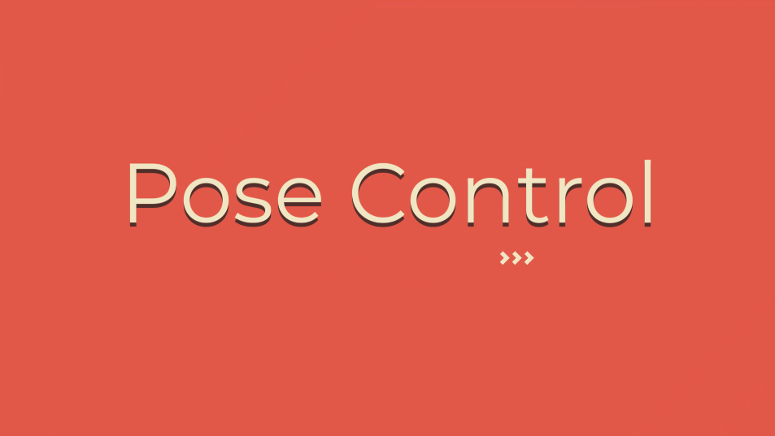

# 🍁 PoseControl
  - **Since the technological revolution, the health of normal human being has tainted a lot.**
  - **Over the past decade, there is a heavy demise in the health (both physical and mental health) of the people.**
  - **To make people aware about their physical fitness, we have tried to design a process with the help of OpenCV and Mediapipe to detect wrong postures and subsequently asking the user not to be in that particular position which can harm the body.**
  - **For the entire process we have used OpenCV for image processing, Mediapipe for posture detection and python's inbuilt pyttsx3 (text to speech) libraries for speech services.**
  
- <h1>Instructions:- </h1> 
> #### [Set up your environment](./INSTRUCTIONS.md)
  - After your environment setup is complete, follow these steps.
  - Place the camera at a such a place and height such that the camera can see the entire body properly.
  - Run the program
